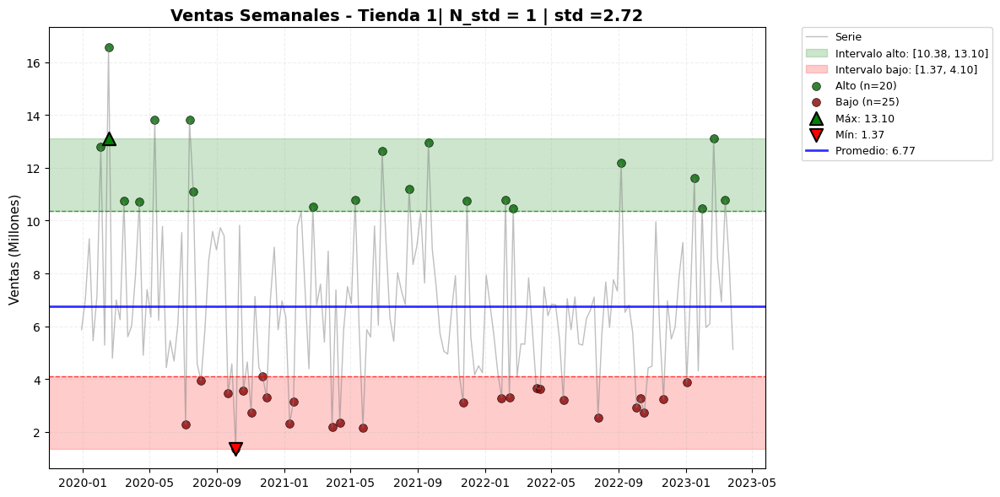

# **Project: Store Analysis – ORACLE Data Science Challenge**

## **Overview**

This challenge is part of the **ORACLE Data Science certification program**.
The goal of the project was to analyze the information provided by **four stores in Colombia** in order to answer the main question:

> **Which store is the best investment option?**

The project includes exploratory analysis, evaluation of business metrics, time series analysis, and visualization of results through a Power BI dashboard.

---

## **Python Analysis**

The analysis was carried out in two main notebooks:
`AnalisisTiendas.ipynb` (EDA) and `ARIMA.ipynb` (Time Series).

### **1. Exploratory Data Analysis (EDA)**

File: **`AnalisisTiendas.ipynb`**

Key metrics from the four stores were analyzed, identifying relevant patterns to assess their performance.

### **Main EDA Findings**

**General daily averages across stores:**

| Metric                 | Average Value |
| ---------------------- | ------------- |
| Shipping cost          | $24,875.14    |
| Average rating         | 4/5           |
| Number of installments | 3             |
| Monthly transactions   | 61            |

**Insights:**

* **Product price does not influence customer rating**.

* Stores adjust **shipping costs based on item value**, making shipping a good indicator of price segmentation.

* There are no significant differences in **transaction volume** among the stores.

* Stores with the **highest total sales** were:

  * **Store 1:** $1,151M
  * **Store 2:** $1,116M

* The top-selling categories were **Electronics**, **Home Appliances**, and **Furniture**.

* Stores with the best average ratings were:

  * **Store 3:** 4.05
  * **Store 2:** 4.02

---

## **2. Time Series Analysis – ARIMA**

File: **`ARIMA.ipynb`**

The initial plan was to train an **ARIMA model for each store** to identify growth trends.
However, autocorrelation analysis (ACF) and the **Ljung–Box test** confirmed that:

> **The weekly sales series behave as white noise**,
> meaning there is no temporal structure suitable for prediction.

Given this, an **alternative evaluation method** was applied:

1. Identification of weekly minimum and maximum sales (removing outliers using quartile analysis).
2. Definition of **upper and lower sales intervals** (based on standard deviations).
3. Percentage of weeks that each store falls within each interval.
4. Comparison of overall performance among stores.

### **Time Series Conclusions**

* **Store 1** spends:

  * **20.6%** of the time in the **upper interval**,
  * **31.8%** of the time in the **lower interval**,
    making it the store with **the fewest weeks in the lowest range**.

* It is also the store with the **highest total sales** overall.

> **Final Conclusion:**
> **Store 1** is the best investment option, combining strong weekly performance, fewer low-range weeks, and the highest accumulated sales.



---

## **Dashboard in Power BI**

An **interactive dashboard** was developed to visualize:

* Comparison among the four stores
* Sales
* Key Performance Indicators (KPIs)
* Time series analysis results

View Dash: [Click](https://mavenshowcase.com/project/54225)
---

## **Project Structure**

```
Challenge_Store_ORACLE/
│
├── data/                      # Raw datasets from the four stores
│
├── data_resul/                # Processed and cleaned datasets
│
├── AnalisisTiendas.ipynb      # Exploratory Data Analysis (EDA)
│
├── ARIMA.ipynb                # Time Series Analysis
│
└── Dashboard (Power BI)       # PBIX file with findings
```

---

## **Technologies Used**

* **Python**

  * pandas
  * numpy
  * seaborn
  * matplotlib
  * statsmodels (ARIMA)

* **Power BI**

  * Data modeling
  * Visualization
  * Executive dashboards

* **Jupyter Notebook** for iterative analysis

---

## **Author**

**Ernesto F.**

> *Junior Data Analyst | Data Science Trainee
> Specialized in data analysis, modeling, and visualization for decision-making.*

